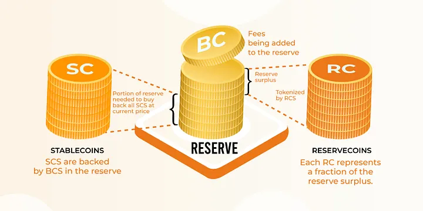

# An Overview of Djed ReserveCoins: Benefits, Risks and More

The Djed Stablecoin Protocol allows users to mint not only stablecoins but also reservecoins. But what are reservecoins? In short:

_Reservecoins tokenize the reserve surplus._
_Each reservecoin gives its holder the right to a portion of the reserve surplus._

Let’s dive deeper into what this means!

[Learn more about how the Djed Stablecoin Protocol is the most resilient stablecoin](https://medium.com/djed-alliance/what-is-the-djed-stablecoin-protocol-a4f49328d138).

## The Reserve, its Surplus and the Reservecoins

In the Djed Stablecoin Protocol, stablecoins are backed by an independent asset in the reserve, not by reservecoins. The reserve actually contains an independent asset — the asset’s value does not depend on the stablecoin protocol itself. In Djed’s paper, this asset is referred to as base coin. For example, in the first three Djed-based stablecoin deployments — SigmaUSD, Djed powered by COTI, and Milkomeda Djed Osiris — the base coins are ERG, ADA, and mADA, respectively.

Since the base coin is volatile (meaning its price may fluctuate significantly), it is important that the reserve contain more than $1 worth of base coins for every stablecoin in circulation. This ensures that every stablecoin remains backed by at least $1 worth of base coins even if the price of base coins falls. This is managed through a reserve ratio — a ratio representing the value of base coins relative to the number of issued stablecoins. The protocol targets a range between 400% and 800%.The excess reserves were designed to cushion against base coin price drops. It is also called the reserve surplus, or equity.

Let’s see a concrete example:

Suppose that, for a given Djed-based stablecoin deployment:

- the price of the base coin (BC) is $0.50,
- 1 million stablecoins (SCs) have been minted,
- the reserve ratio is 400%.

To back every stablecoin 1-to-1, a reserve of 2 million BCs would be needed:

(2 million * $0.50 = $1 million).

This would result in a reserve ratio of 100%. With a reserve ratio of 400%, every stablecoin is backed 4-to-1. So, there are actually 8 million BCs in the reserve. And there is a reserve surplus of 6 million BCs.

Is the reserve surplus just idling there, inefficiently? No. It is tokenized through reservecoins!

Returning to our example, suppose that:

- 4 million reservecoins (RCs) are minted, each representing a portion of the 6 million BC surplus — specifically, 1.5 BCs per RC.

As long as the reserve ratio remains within the target range, holders can redeem 1 RC for 1.5 BCs, or mint new RCs by depositing 1.5 BCs into the reserve.

## Benefits of Reservecoins

So, now we know that a reservecoin coin represents an amount of base coins in the reserve surplus. But why should one be interested in holding reservecoins? Why is holding a reservecoin better than just holding base coins?

There are mainly two reasons.

### Fee Revenue

As people mint and redeem stablecoins and reservecoins, they must pay minting and redemption fees. These fees accumulate in the reserve and thus contribute to a growing reserve surplus. All other things remaining equal, this leads to a growth in the reservecoin price.

Let’s see this in our running example. Suppose that:

- The fee is 2% of the amount minted or redeemed.
- Over a period of 1 year, there was a volume of 7.5 million stablecoins minted and a volume of 7.5 million stablecoins redeemed across multiple transactions. (So, at the end of the year, the number of stablecoins remains at 1 million as in the beginning of the year)
- For the sake of simplicity, no reservecoins have been minted or redeemed and the price of base coins remained constant.

With a total volume of 15 million stablecoins transacted, $300k worth of base coins will have been paid in fees (since 2% of $15m is $300k). At a price of $0.50 per base coin, this means that 600k base coins will have been paid in fees. Therefore, at the end of the year, the reserve will contain a total of 8.6 million base coins. Out of these, 6.6 million base coins will be the reserve surplus. Now, each of the 4 million reservecoins will represent (and be redeemable for) 1.65 base coins. So, initially, 1 reservecoin was valued at 1.5 base coins, but it has increased to 1.65 base coins, representing a 10% rate of return.

In this sense, reservecoins are similar to LP tokens in a liquidity pool. Both reservecoin holders and liquidity providers benefit from transaction fees — reservecoin holders from stablecoin minting and redemption, and LP token holders from asset swaps in the pool. However, the underlying mathematical models for Djed and liquidity pools differ significantly.

### Leverage

Reservecoins have a built-in leverage effect with respect to the underlying base coins. When the price of the base coins go up, the price of the reservecoins goes even more up. Let’s see this in our running example.

Let’s go back in time to the beginning of the year and let’s suppose that:

- The base coin price increases from $0.50 to $1.

The reserve will still contain 8 million base coins, but 1 million base coins are sufficient to back the stablecoins. Hence, the reserve surplus is now 7 million base coins. Therefore, each reservecoin (out of the 4 million) is now worth 1.75 base coins.

We went from:

- 1 RC = 1.5 BC = $0.75

To:

- 1 RC = 1.75 BC = $1.75

Whereas the base coin doubled in value, the reservecoin’s value was multiplied by 2.33.

## Risks of Reservecoins

So, holding reservecoins sounds great. What is the catch?

There are always risks! The best we can do is to be as transparent as possible about the risks.

One cannot magically make risks disappear. If you are looking for a “stablecoin” protocol promising you, let’s say, risk-free 20% annual returns, stop reading now and go lose yourself some money in the next Terra-like “unstablecoin”.

In the case of Djed, there are three risks.

### Leverage

Leverage is a double-edged sword. If the price of the underlying base coin goes down, the price of the reservecoin goes even more down. To get an idea, let’s go back to our running example. Suppose that, instead of going from $0.50 to $1, the price of the base coin goes to $0.25.

Then the reserve will still contain 8 million base coins, but now 4 million base coins will be needed to back the 1 million stablecoins. Hence, the reserve surplus is now only 4 million base coins. Therefore, each reservecoin (out of the 4 million) is now worth only 1 base coin.

We went from:

- 1 RC = 1.5 BC = $0.75

To:

- 1 RC = 1 BC = $0.25

Whereas the base coin halved in value, the reservecoin’s value was divided by 3.

## Redemption Friction when Reserve Ratio is Low

- To maintain a healthy reserve ratio range, the Djed stablecoin protocol adjusts the ease of reservecoin redemption based on the reserve ratio. When the reserve ratio is low, redeeming reservecoins can further reduce the ratio even more. The approach to managing this varies across Djed versions:

- In the versions implemented in SigmaUSD, Djed powered by COTI and Zephyr, direct redemption is disabled if the reserve ratio falls below a minimum threshold. When this happens, a reservecoin holder wishing to dispose of reservecoins must resort to selling them in a secondary market.

- In the “Extended Djed” version, redemption of reservecoins is always possible, but fees increase as the reserve ratio decreases from the optimal level.
In the “Osiris” version of Djed, implemented in Milkomeda Djed Osiris, redemption is allowed below the threshold only if enough stablecoins are redeemed simultaneously to prevent further reduction in the reserve ratio.

## Oracle Risks

The value of a reservecoin depends on the reserve surplus and thus it indirectly depends on the price provided by the oracle. For example, if the oracle says that the price of the base coin is lower than it really is, then more base coins will be allocated to back the stablecoins, the reserve surplus will be lower than it should be, and each reservecoin will be worth fewer base coins than it should. While all Djed versions incorporate mechanisms to mitigate oracle-related risks, some level of risk persists.

## Final Remarks

Reservecoins are a novel asset class with distinct benefits and risks. The examples in this article are hypothetical, designed to clearly describe those cases. In practice, benefits and risks occur simultaneously. For instance, a drop in base coin price might increase transactions and fee revenue, causing both a downward price movement from leverage and an upward movement from fees, which may offset each other.

For more details, we encourage reading the [Djed stablecoin paper](https://eprint.iacr.org/2021/1069).

Visit the [Djed Alliance's Website](https://djed.one/) to find out where to trade reservecoins of the various deployments of the Djed Stablecoin Protocol.

## About the Djed Alliance

The [Djed Alliance](https://djed.one/) aims to stabilize the digital economy through the Djed Stablecoin Protocol.

The Djed Stablecoin Protocol is deployed across multiple networks and can be used to create your stablecoin. Join our [growing community](https://discord.gg/ggxP4ttHgN) and together, we will advance the future of the decentralized economy
