# Using SigmaUSD on Cardano

SigmaUSD is the first deployment of the Djed Stablecoin Protocol, live since Q1 2021 on Ergo, and now available on Cardano thanks to the Rosen Bridge.

This tutorial demonstrates how to buy SigUSD (the stablecoin) or SigRSV (the reservecoin) and have them on your Cardano wallet. It assumes that you are a Cardano user with no familiarity with the Ergo ecosystem. Ultimately you will learn to:

- Transfer Cardano assets to Ergo and vice versa
- Install and use an Ergo wallet
- Use the transferred assets in Ergo dApps
- Buy SigUSD and SigRSV using the transferred assets and hold them in your Cardano wallet.

## Install an Ergo Wallet

To start the process, you will need to install an Ergo wallet. We recommend [Nautilus](https://chromewebstore.google.com/detail/nautilus-wallet/gjlmehlldlphhljhpnlddaodbjjcchai), a lightweight self-custodial wallet capable of connecting to dApps. Install the Nautilus browser extension using the [Chrome store](https://chromewebstore.google.com/detail/nautilus-wallet/gjlmehlldlphhljhpnlddaodbjjcchai).

### Create a wallet

Once the Nautilus wallet is installed, you can create a new wallet by opening the extension.

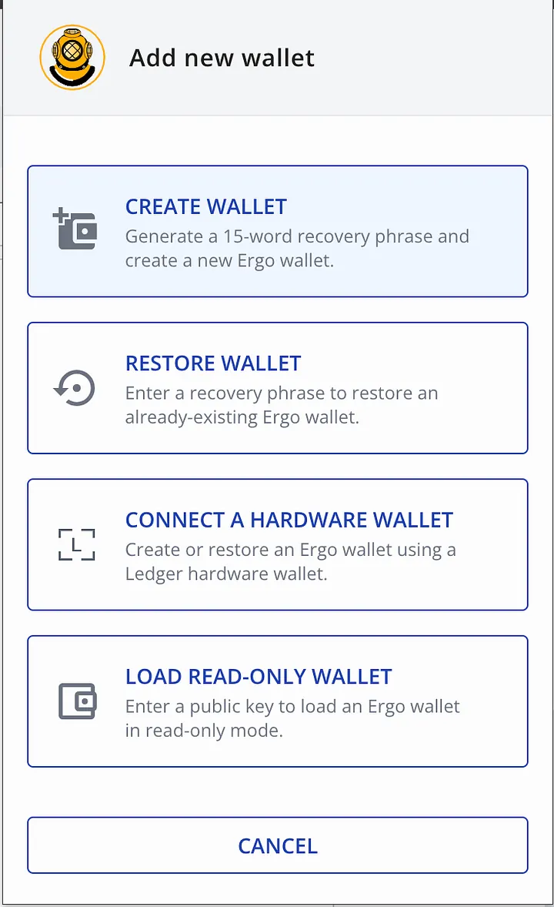

Make sure you securely store the Mnemonic for your wallet. Your created wallet does not contain any assets. In the next steps, we will transfer assets from Cardano to this wallet on Ergo.

## Transfer ADA to Ergo by Using Rosen Bridge

### What is Rosen?

Rosen Bridge is an open-source protocol for cross-chain asset transfers. It currently supports Ergo and Cardano blockchains and soon will support other blockchains such as Bitcoin!

Using Rosen Bridge you can transfer your assets between any two supported blockchains without needing to trust a single point of failure.

### Transfer ADA to Ergo

To transfer your assets to Ergo, follow the following steps:

- Make sure you have your desired amount of ADA in a Cardano wallet such as [Eternl](https://eternl.io/).
- Visit [app.rosen.tech](https://app.rosen.tech/) and select Cardano as source and Ergo as target blockchains.

<figure>
  
</figure>

- Connect your Cardano wallet by clicking on “CONNECT WALLET”. Here we use Eternl.

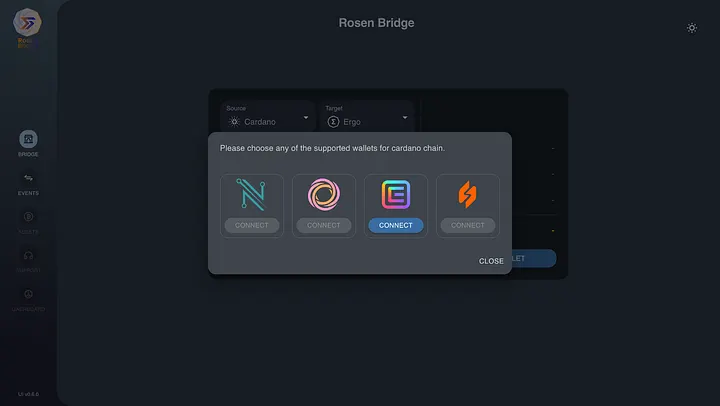

- Select ADA in the token section and enter the desired amount of ADA you wish to transfer.
- Open your Nautilus wallet, click on the receive tab, and copy your Ergo address.

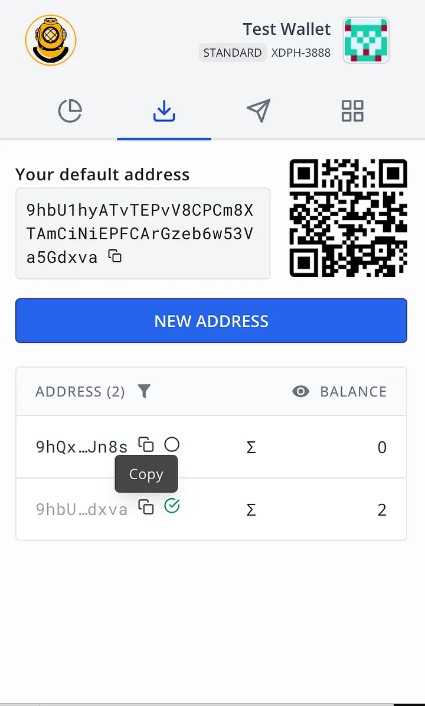

- Enter the copied address in the address section of Rosen.

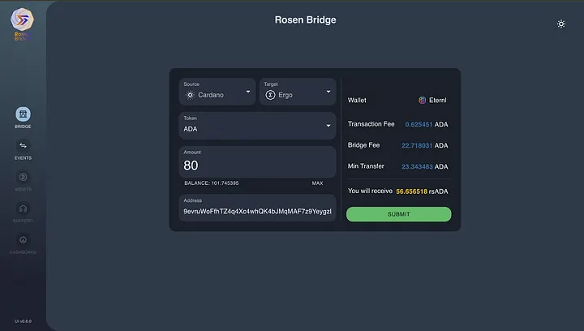

- Click on submit to open Eternl. You will be asked to enter your wallet password.

After submitting the request, Rosen will transfer your assets to your Ergo wallet in a few minutes! Once your transferred ADA is received in your Nautilus wallet, you will be able to see it as rsADA. Rosen Bridge will send you some ERG alongside rsADA. You don’t need to obtain ERG in some other way as this amount should be enough to cover the transaction fees for the next steps.

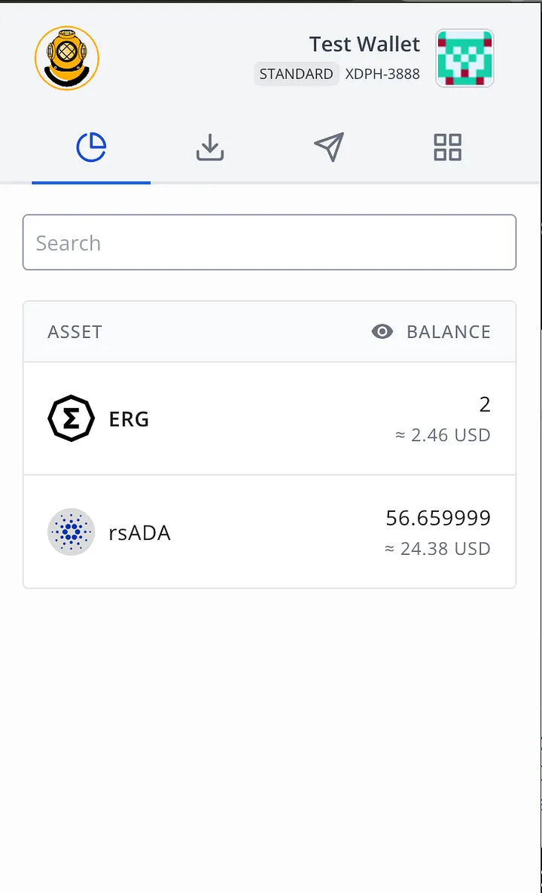

Rosen Bridge is NOT designed to be fast. But it is designed to be secure and reliable. Consequently, it may take a while for your transfer to complete but you can always be assured that your assets are safe!

### Convert rsADA to SigUSD or SigRSV

Now that you have rsADA on Ergo, you can use it in Ergo’s native dApps. Here we demonstrate how to use rsADA in Spectrum to buy SigUSD or SigRSV in a few steps.

- Visit [Spectrum](https://app.spectrum.fi/ergo/swap?base=e023c5f382b6e96fbd878f6811aac73345489032157ad5affb84aefd4956c297&quote=0000000000000000000000000000000000000000000000000000000000000000&initialPoolId=ae97c5eccd59a065cd973a8d6afb8bb79f9cc70368a7dcdf73aaeab1cedf6f6b) and connect your Nautilus wallet by clicking on Connect Wallet.

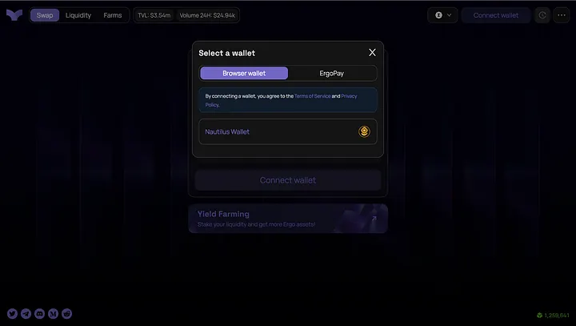

- Select rsADA and ERG as assets to be converted.

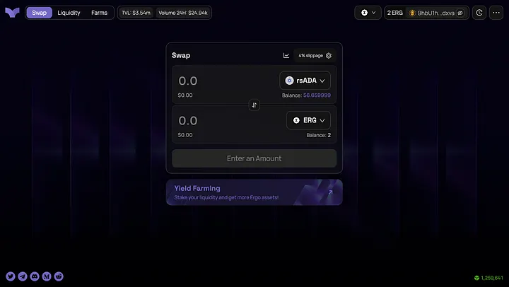

- Specify your desired rsADA amount to be converted to ERG.
- Click on Swap and confirm the transaction in your Nautilus wallet.

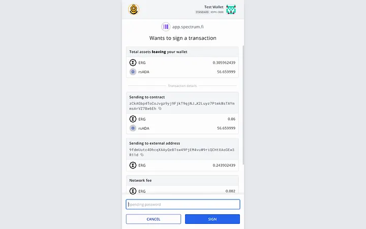

- Wait for the swap to complete. You can track the swap transaction until it is confirmed. You will be able to see ERG in your Nautilus wallet once the swap is done.

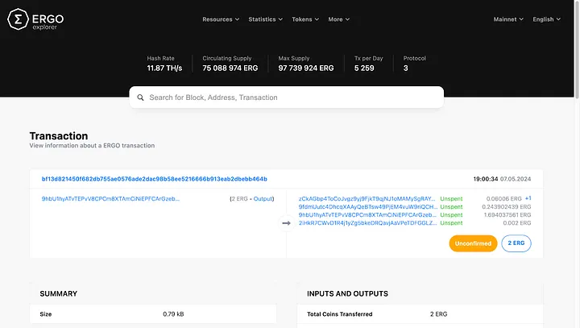

- Repeat the same process to swap ERG for SigUSD/SigRSV on [Spectrum](https://app.spectrum.fi/ergo/swap?quote=03faf2cb329f2e90d6d23b58d91bbb6c046aa143261cc21f52fbe2824bfcbf04&base=0000000000000000000000000000000000000000000000000000000000000000).

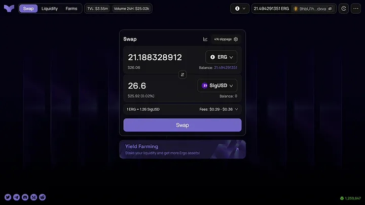

Once these steps are completed. You will have SigUSD/SigRSV in your Nautilus wallet. The last step is to transfer them to your Cardano wallet.

In this tutorial, we converted rsADA to SigUSD/SigRSV using Spectrum in two steps: rsADA to ERG and then ERG to SigUSD/SigRSV. It is worth mentioning that, in the future, you may be able to directly convert rsADA to SigUSD/SigRSV if a liquidity pool with these pairs are created!

### Convert ERG to SigUSD or SigRSV using sigmausd.io (optional)

Once you get a hold of ERG, you can either use Spectrum to buy SigUSD/SigRSV as explained above or you can use sigmausd.io. This website is the original SigmaUSD dApp that directly interacts with the protocol bank box! Usually, using sigmausd.io results in a better rate for larger amounts compared to Spectrum.

Follow these steps to buy SigUSD/SigRSV using sigmausd.io:

- Click on Set Wallet and connect your Nautilus wallet.

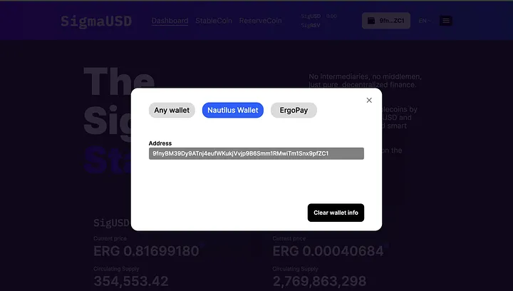

- Click on StableCoin or ReserveCoin depending on whether you want to buy SigUSD or SigRSV.
- Enter your desired amount and then click on Purchase.

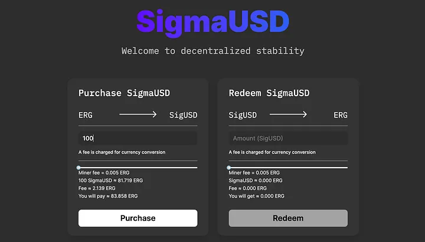

Once you confirm the transaction in your Nautilus wallet and the transaction is confirmed, you will be able to see SigUSD/SigRSV tokens in your wallet.

### Transfer SigUSD or SigRSV to Cardano

Now we have to follow the same steps that we took to transfer ADA to Ergo to transfer SigUSD/SigRSV to Cardano. Select Ergo and Cardano as source and target blockchains respectively. Enter your desired amount, and your Cardano address then click on submit.

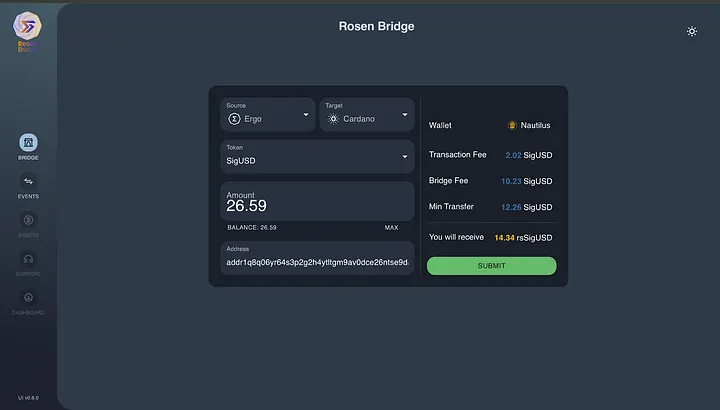

You will have to wait for Rosen to transfer the assets to Cardano. You can view your transfer request in the EVENTS section after a few minutes.

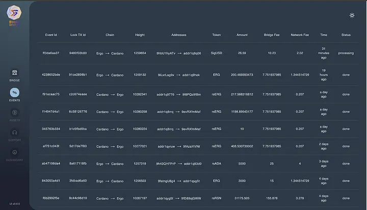

Once the assets are transferred, you will be able to see them in your Cardano wallet as rsSigUSD and rsSigRSV.

## Making the process easier!

There are some plans in the community to make this process much easier for Cardano users. Hopefully, in the future, Cardano users will be able to get a hold of any Ergo assets in one step!

## About the Djed Alliance

The [Djed Alliance](https://djed.one/) aims to stabilize the digital economy through the Djed Stablecoin Protocol.

The Djed Stablecoin Protocol is deployed across multiple networks and can be used to create your stablecoin. Join our [growing community](https://discord.gg/ggxP4ttHgN) and together, we will advance the future of the decentralized economy.
