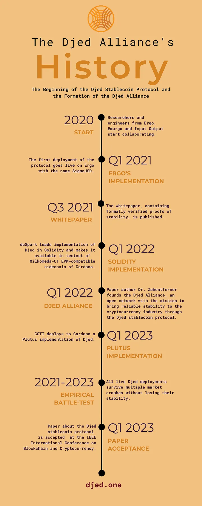

# The History of Djed and the Djed Alliance

The cryptocurrency industry was born with the goal to build decentralized forms of money. However, for an asset to actually be able to perform the functions of money as a unit of account, a store of value and a means of exchange, its price must be stable. This is why as early as at least 2014, various stablecoin protocols were already being proposed, although it was only around 2018 that the adoption of stablecoins really started to take off. The design of stablecoins is crucial for the cryptocurrency industry, not only due to the industry’s primordial goal, but also because they are a foundational component in decentralized finance (DeFi).

By 2020, much had been learned from previous stablecoin designs, their strengths and weaknesses. Humbly leveraging these learnings, the creation of a new stablecoin protocol, with simplicity and transparency as key design goals, started in 2020 by a collaboration team comprising researchers and engineers who were then affiliated with [Ergo](https://ergoplatform.org/en/), [Emurgo](https://emurgo.io/) and [Input Output](https://iohk.io/). Implementations for the Ergo and Cardano ecosystems were planned and they were provisionally named, respectively, AgeUSD and BelUSD after the Egyptian myth of the twin brothers [Agenor](https://en.wikipedia.org/wiki/Agenor) and [Belus](https://en.wikipedia.org/wiki/Belus_(Egyptian)).

In February 2021, the first production-ready implementation, coded in the ErgoScript smart contract language, was completed and deployed to the Ergo blockchain under the name SigmaUSD (instead of AgeUSD). It survived all the cryptocurrency industry’s market crashes since its launch without losing its stability. Ergo is a next-generation smart contract platform that ensures the economic freedom of ordinary people through secure, accessible and decentralized financial tools. Notably, Ergo uses Proof-of-Work and UTxO (like Bitcoin), but extends it in a way that makes it possible and convenient (unlike Bitcoin) to develop expressive smart contracts. SigmaUSD is, to the best of our knowledge, the first deployment of a stablecoin protocol on a UTxO-based blockchain, and SigmaUSD was the first major decentralized application developed on Ergo, paving the way for Ergo’s current vibrant and innovative DeFi ecosystem.

Research and development progressed in parallel with daily asynchronous communication among all researchers and engineers in the initial collaboration team. Research was led by Dr. Joachim Zahnentferner, who was soon joined by Dr. Dmytro Kaidalov. Although the abstract mathematical specification of the minimal version of the protocol was ready as early as Q4 2020, stating and proving the stability theorems took several months. In Q2 2021, Dr. Zahnentferner and Dr. Kaidalov were joined by Javier Díaz and Dr. Jean-Frédéric Etienne, who were responsible, respectively, for the formal verification and bounded model checking of the protocol. In July 2021, the [technical white paper](https://eprint.iacr.org/2021/1069) was released to the public and Zahnentferner named the protocol Djed, after an [ancient Egyptian pillar-like symbol representing stability](https://en.wikipedia.org/wiki/Djed).

In 2021, some of the engineers from the original collaboration team founded [dcSpark](https://www.dcspark.io/), which is now a major player in the Cardano ecosystem, especially in the area of developer tooling and wallets. They built [Milkomeda-C1](https://milkomeda.com/), the EVM-compatible sidechain of Cardano, with all the necessary ingredients for a seamless and frictionless experience for Solidity developers to build projects for the Cardano ecosystem. Together with [VacuumLabs](https://vacuumlabs.com/) and one other anonymous entity, they implemented the Djed stablecoin protocol in the Solidity smart contract language and deployed it to a testnet of Milkomeda-C1 in February 2022.

In 2021 and 2022, Input Output and COTI developed an implementation of Djed in the Plutus smart contract language for Cardano, a top Proof-of-Stake UTxO-based blockchain. Input Output is the main company developing Cardano and the Plutus language. This implementation counted with Djed whitepaper co-author Dr. Jean-Frédéric Etienne as the main developer and it demonstrates several major features and design patterns of Plutus. This implementation was deployed on Cardano in February 2023 by COTI, a long-term and prominent contributor to the Cardano ecosystem.

In February 2022, Zahnentferner founded the Djed Alliance. Its singular commandment is to bring reliable stability to the cryptocurrency industry and its main approach to achieve this mission is to foster the evolution of the Djed stablecoin protocol and to support implementations and deployments of the protocol. The Djed Alliance is an open network. All it takes to be part of it is to have contributed to the Djed stablecoin protocol in some form and to collaborate with others in the alliance towards the alliance’s commandment.

The Djed Alliance assisted COTI in its [AMA about COTI’s Djed](https://cotinetwork.medium.com/djed-ama-recap-6c710f70e441) in June 2022, was selected for the Milkomeda Accelerator program in July 2022, participated in the Ergo Summit in August 2022 with a talk on [how to improve Djed and SigmaUSD](https://t.co/XGoNTBEH1Z) and co-organized a [Hackathon](https://ergoplatform.org/en/blog/ErgoHack-5-Results/) with Ergo in September 2022.

In Q3 and Q4 of 2022, contributors from [Bloxico](https://bloxico.com/) and [AOSSIE](http://www.aossie.org/) (together with dcSpark and VacuumLabs) refactored the Solidity implementation for Milkomeda-C1 to a new version of the protocol, taking into account lessons learned from Ergo’s SigmaUSD’s two years of success. This implementation is expected to pave the way for deployments on various EVM-compatible blockchains, including Milkomeda-C1.

Meanwhile, in the academic world, a [stablecoin report](https://papers.ssrn.com/sol3/papers.cfm?abstract_id=4226071) by the [Blockchain Governance Initiative Network (BGIN)](https://bgin-global.org/), delving into regulatory aspects of stablecoins, was co-authored by Djed Alliance contributors in 2022 and a research collaboration between Dr. Zahnentferner and Prof. Giselle Reis, Mohammad Shaheer and Demetre Devidze from CMU Qatar, to investigate variants of Djed as well as formally verified oracles started in Q2 2022 and is currently ongoing.

In February 2023, after a long and thorough peer-review process, an academic paper about the minimal version of Djed, authored by Joachim Zahnentferner, Dmytro Kaidalov, Javier Díaz and Jean-Frédéric Etienne, was accepted at the [IEEE International Conference on Blockchain and Cryptocurrency](https://icbc2023.ieee-icbc.org/authors/call-papers).

The Djed Alliance keeps growing beyond the original collaboration team and we welcome new collaborators who would like to work together to achieve our mission.

