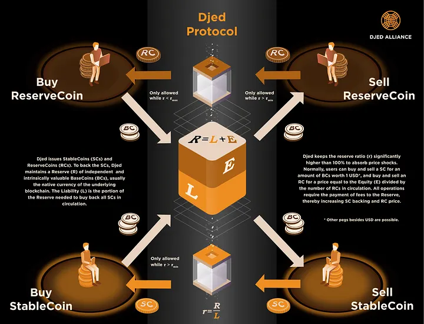
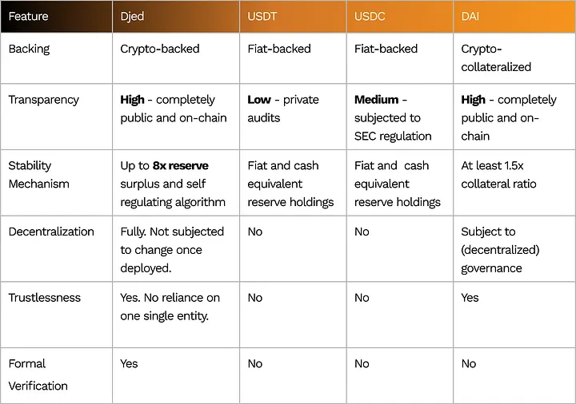

# What is the Djed Stablecoin Protocol?

## Introduction

Researched and developed by a team of 5 expert engineers from Ergo, Emurgo, IOG, (who then later formed the [Djed Alliance and The Stable Order](https://djed.one/)), the Djed Stablecoin Protocol was created to tackle the stablecoin trilemma of achieving reliable stability, decentralization, and capital efficiency simultaneously — a challenge that eludes most stablecoins.

While stablecoins like USDC and USDT offer relative stability, they are controlled by centralized entities. Similarly, algorithmic stablecoins, including MakerDAO’s DAI, face challenges in achieving full decentralization, often influenced by governance.

Djed sets itself apart by addressing all three critical aspects.

- It ensures a significant reserve surplus to maintain its value even in market downturns,
- It operates on a decentralized framework that is tamperproof and immutable without the need for governance, and
- It maximizes capital efficiency by tokenizing the reserve surplus with tokens that can be used elsewhere.

Unique to Djed is its self-regulating mechanism that functions akin to an autonomous bank, algorithmically managing the buying and selling of stablecoins to keep their value stable without external intervention. In addition, Djed’s protocol is designed to be chain agnostic and open source, allowing for deployment across various networks to create native stablecoins.

_[Learn how to deploy a Djed-based stablecoin on your blockchain](https://docs.djed.one/about-us/the-djed-alliance/create-a-djed-based-stablecoin)_

## Battle-tested and proven

Since its first deployment in early 2021, Djed has maintained its peg through numerous cryptocurrency market downturns, demonstrating unwavering stability. This is attributed to meticulous planning and rigorous testing across different scenarios. Key characteristics of Djed include:

- Peer reviewed: [The Djed Stablecoin Protocol’s minimal version](https://ieeexplore.ieee.org/document/10174901) was accepted for presentation at the prestigious IEEE International Conference on Blockchain and Cryptocurrency, underscoring its academic and technical validation.

- Formally verified: Stability theorems have been mathematically proven and the theorems and their proofs have been formally verified with bonded model checkers and interactive theorem provers.

- Crypto-backed: Djed uses a reserve of an independently valuable crypto-asset, usually the native cryptocurrency of the underlying blockchain to back the stablecoins and provide them with intrinsic value.

Learn more: Crypto-backed and crypto-collateralized are [two different concepts](https://medium.com/djed-alliance/addressing-the-stablecoin-trilemma-da3191162a13)

- Maintaining a Reserve Surplus: With reserve levels typically ranging from 400% to 800%, Djed significantly reduces the risk of de-pegging, ensuring stable performance even amidst market volatility.

- Truly decentralized: Once deployed, its contract is immutable, tamperproof, and operates autonomously requiring no governance.

- Fully transparent: Everything is public and recorded on-chain.

- Maximizing security: Djed can be natively deployed across various blockchains, strengthening chain security without the need for wrapped tokens or bridges, thus mitigating associated risks.

## How Djed works

Djed is designed to be stable and redeemable under any circumstances. It seeks to maintain a minimum and maximum reserve ratio between 400% and 800%. This means even if the base coin’s value drops suddenly by 75%, Djed’s stability isn’t compromised.

The foundation of its stability lies in a reserve of intrinsically and independently valuable base coins (typically the native token of the underlying blockchain).

- Base coins are added to the reserve whenever stablecoins or reserve coins are minted/bought.

- Every buy/mint or sell/burn transaction incurs a small fee which is added to the reserve increasing the backing of stablecoins and the reserve surplus.

The mechanism is designed to motivate base coin holders to provide liquidity by buying reserve coins, thereby reinforcing Djed’s stability. And for each stablecoin in circulation, it is backed by 4 to 8 times the amount in base coins, to ensure the stablecoin value is well-protected.

- Should the reserve ratio fall below 400%, new stablecoin issuance halts, and reserve coins cannot be burned, to prevent the reserve ratio from dropping further.

- Djed-based stablecoins remain redeemable at all times.

_[Learn more about the Djed Stablecoin design](https://iohk.io/en/research/library/papers/djed-a-formally-verified-crypto-backed-pegged-algorithmic-stablecoin/)_

## Djed compared to other stablecoins

## Final words

Djed stands out as a stablecoin adeptly addressing the stablecoin trilemma. It is being actively deployed and tested across numerous networks, and used in real-world environments. [The Stable Order](https://djed.one/) is committed to continuous research, gathering feedback, monitoring performance, and refining the framework with every deployment.

## About the Djed Alliance
The [Djed Alliance](https://djed.one/) aims to stabilize the digital economy through the Djed Stablecoin Protocol.

The Djed Stablecoin Protocol is deployed across multiple networks and can be used to create your stablecoin. Join our [growing community](https://discord.gg/ggxP4ttHgN) and together, we will advance the future of the decentralized economy.